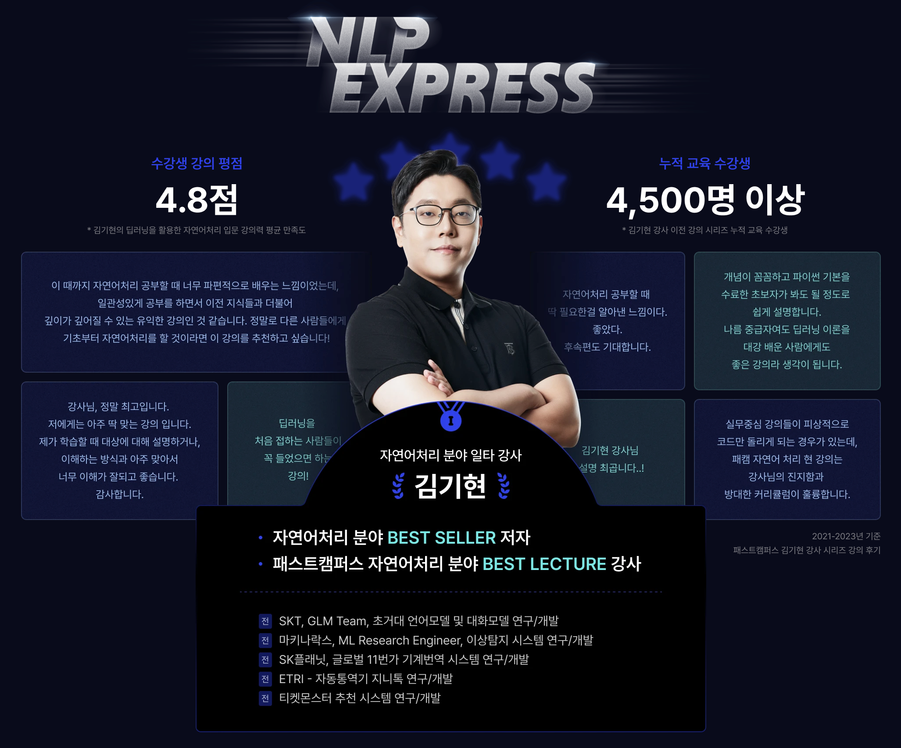
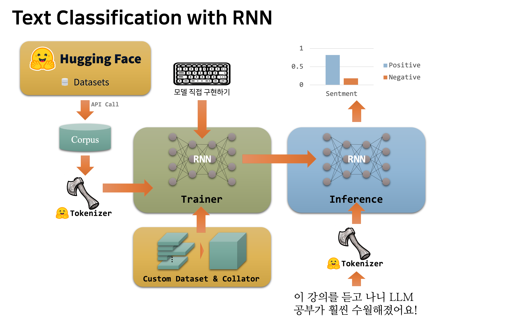
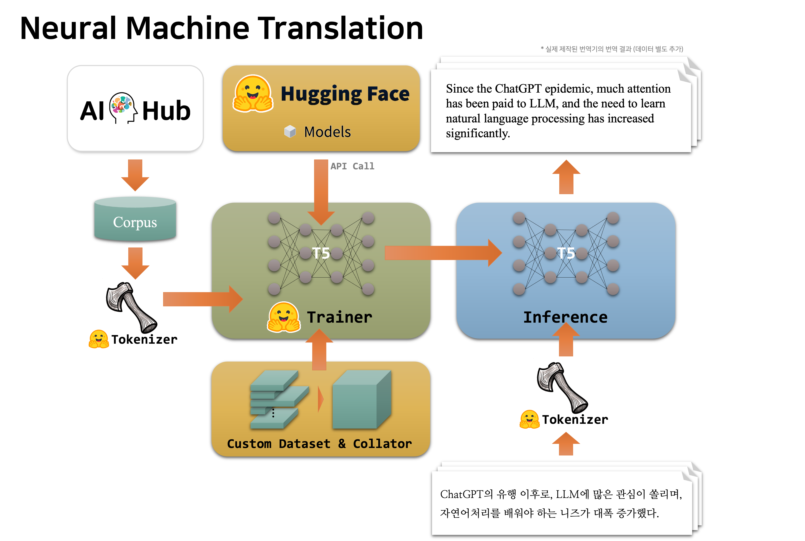
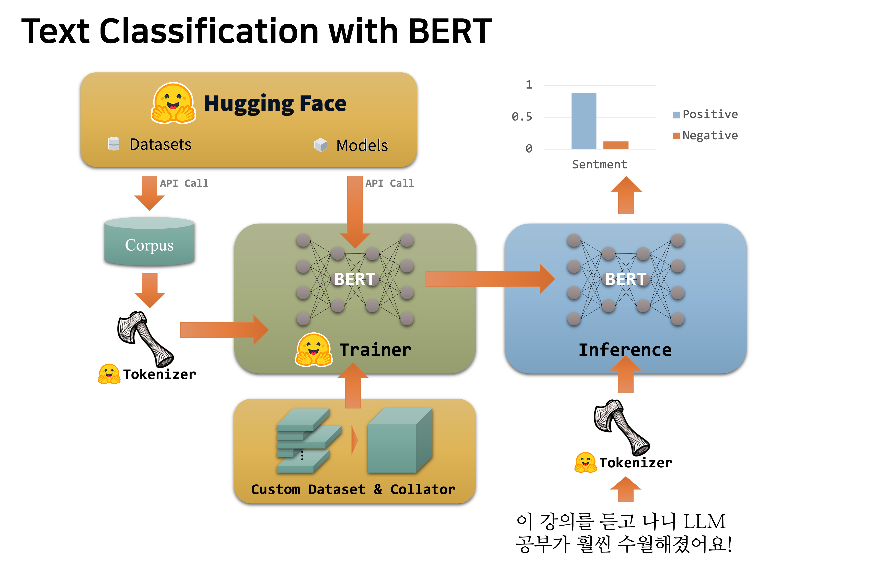

# LLL을 위한 NLP Express 강의 실습 자료

안녕하세요, 김기현입니다.

이 repo는 패스트캠퍼스의 자연어처리 강의 [LLM을 위한 김기현의 NLP EXPRESS](https://fastcampus.co.kr/data_online_nlpexpress) 강의의 실습 자료를 담고 있는 repository 입니다.

### 강의 소개

해당 강의는 LLM에 본격적으로 입문 하기 전에 필요한 자연어처리 알짜 지식들만 모아서 약 20여시간에 걸쳐서 빠르게 배울 수 있도록 하는 강의입니다.
앞서 수 년전에 제작되었던 약 100시간 분량의 강의를 LLM을 배우는데 필요한 지식들만 모으고 압축해서 20시간으로 만들었다고 보시면 좋습니다.

다만 이 강의는 딥러닝 기초에 대해서는 거의 다루지 않으며, 딥러닝 기초를 탄탄하게 다지실 분들은 패스트캠퍼스의 강의 [딥러닝 유치원](https://fastcampus.co.kr/data_online_pytorch) 을 참고 부탁드립니다.
해당 강의는 한빛출판사에서 출판한 [김기현의 딥러닝 부트캠프 with PyTorch](https://www.yes24.com/Product/Goods/112198327) 와 비슷한 커리큘럼을 가지고 있으며, 해당 도서는 2023년도 세종도서에 선정되었습니다.

또한 실습의 경우에도 현재 자연어처리 업계의 사실상 표준으로 자리잡은 허깅페이스 라이브러리를 대부분 활용하였습니다.
따라서 수강생들이 여러차례에 걸친 실습을 통해 허깅페이스 라이브러리에 익숙해질 수 있으며, LLM에서의 소프트랜딩이 가능해질 것입니다.

강의 목차는 다음과 같이 구성되어 있습니다.

#### Part 1. 자연어처리 입문

- Chap 1. Orientation
- Chap 2. Introduction
- Chap 3. Deep Learning Review
- Chap 4. Preprocessing (실습)

#### Part 2. 자연어이해 (NLU)

- Chap 5. Word Embedding
- Chap 6. Recurrent Neural Networks
- Chap 7. Text Classification with RNN (실습)

#### Part 3. 자연어생성 (NLG)

- Chap 8. Language Modeling
- Chap 9. Transformers
- Chap 10. Neural Machine Translation (실습)

#### Part 4. 사전학습언어모델 (PLM)

- Chap 11. Introduction to PLMs
- Chap 12. PLMs
- Chap 13. Text Classification with BERT (실습)
- Chap 14. Class Summary

### 실습 자료 구성

이 repo는 위 강의 구성에서 실습이라고 표기된 챕터에 필요한 실습 자료들을 담고 있습니다.

#### 실습 환경

- Python 3.8

|package|version|
|:-:|:-:|
|PyTorch|torch==2.1.2|
|Huggingface Transformers|transformers==4.36.1|
|Huggingface Tokenizers|tokenizers==0.15.0|
|Huggingface Datasets|datasets==2.15.0|
|WandB|wandb==0.16.1|

자세한 내용은 requirements.txt 또는 environment.yaml 을 참고/활용 부탁드립니다.

#### 04-preprocessing 디렉터리

허깅페이스 토크나이저의 실습 코드로 구성되어 있습니다.
코퍼스를 통해 새로운 나만의 토크나이저를 학습하는 방법과 기존의 토크나이저를 활용하는 방법에 대해 다루고 있습니다.
그 밖에도 토크나이저의 특수 토큰의 활용등 다양한 내용을 자세히 다룹니다.

#### 07-rnn_text_classification 디렉터리

RNN을 활용한 텍스트 분류(예: 감성분석)를 수행하는 프로젝트를 실습합니다.
허깅페이스에서 제공하는 코드에서 동작하기 위한 커스텀 RNN 모델의 구현과 토크나이저의 학습/활용에 대해서 실습을 수행합니다.

#### 10-nmt 디렉터리

T5 아키텍처를 활용하여 AIHub 데이터셋을 기반으로 신경망 기계번역기를 제작하는 프로젝트를 실습합니다.

#### 13-bert_text_classification 디렉터리

BERT를 활용하여 텍스트 분류(예: 감성분석)를 수행하는 프로젝트를 실습합니다.

### Contact

Author: Kim, Ki Hyun
Email: nlp.with.deep.learning@gmail.com
